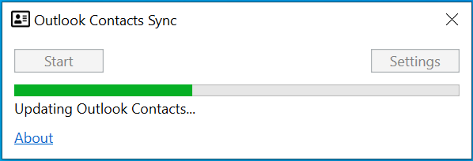

# Outlook Contacts Sync

Syncs domain users from Active Directory to your Microsoft Outlook Contacts list.

*[Download](https://github.com/cschotte/outlook-contacts-sync/blob/master/Download/outlook-contacts-sync.zip?raw=true)*

## Working

This tool will query your on-premise Active Directory for users and syncs the result with Microsoft Outlook. If your organization’s Active Directory is very large (1500+ users), you can filter the results in the settings screen.

## Example Active Directory Query

For example, if you like to filter on physical office location and departments, use a query like this
```
(|(physicaldeliveryofficename=SCHIPHOL*)(department=NL*)(department=EQ-NL*)(department=EQ-EQ-NL*)(company=NETHERLANDS))
```

Or all direct reports from your manager
```
(manager=CN=John Doe,OU=UserAccounts,DC=europe,DC=corp,DC=microsoft,DC=com)
```

## Main Screen



## License

Copyright (c) 2018 by NavaTron. All rights reserved.

*Code License: [MIT](LICENSE)*

Applies to all other files
